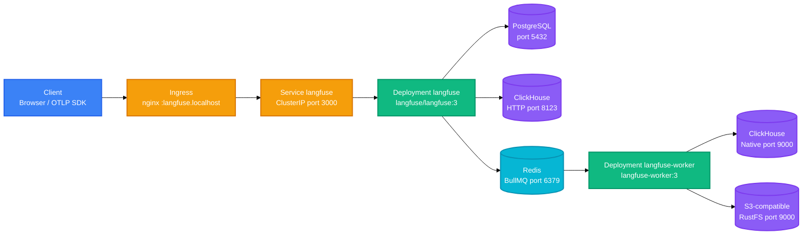

<!-- BEAUTIFIED -->

<h1 align="center">LangFuse k8s overlay</h1>
<p align="center">
  <strong>Kubernetes manifests for self-hosting the LangFuse v3 LLM observability platform.</strong>
  <br />
  <em>Configuration-only overlay · Ingress · App + worker split</em>
</p>

<p align="center">
  <a href="#quick-start"></a>
</p>

<p align="center">
  
  
  
  
  
  
</p>

<p align="center">
  
  
  
</p>

This repository contains only infrastructure configuration. There is no application source code, package manager, build tooling, or tests — just the `k8s/` manifests, the `.gitignore`, and this README.

## Features

- **Configuration-only overlay** — Two YAML files define four resources: Service, app Deployment, Ingress, and worker Deployment, plus one gitignored Secret.
- **App / worker split** — The app Deployment serves the web UI, REST API, and OTLP ingestion; the worker Deployment consumes BullMQ jobs from Redis.
- **Single shared Secret** — Both Deployments pull every runtime variable from one `langfuse-secret` via `envFrom.secretRef`, so configuration lives in exactly one place.
- **Backing services by sibling DNS** — PostgreSQL, ClickHouse, and Redis are resolved by in-cluster names (`postgres`, `clickhouse`, `redis`) in the same namespace.
- **Auto migrations on startup** — The app runs PostgreSQL migrations unless disabled, so fresh databases bootstrap automatically.
- **Local-first networking** — An nginx Ingress exposes the stack at `langfuse.localhost`, with the OTLP endpoint reachable over the same host.

## Quick Start

### Prerequisites

- A Kubernetes cluster with an nginx ingress controller.
- Backing services `postgres`, `clickhouse`, and `redis` running as siblings in the same namespace.
- `k8s/langfuse-secret.yaml` populated with the required keys (see [Configuration](#configuration)).

### Configure

```bash
# populate the gitignored secret with the required env keys, then
# validate the manifests without touching a cluster
kubectl apply --dry-run=client -f k8s/
```

### Deploy

```bash
kubectl apply -f k8s/
```

### Access

```bash
# langfuse.localhost is not publicly routable; resolve it locally
echo "127.0.0.1 langfuse.localhost" | sudo tee -a /etc/hosts
# open http://langfuse.localhost
```

## Usage

The following examples cover the common workflows against this overlay.

### Verify the rollout

```bash
kubectl get pods -l app=langfuse
kubectl get deploy langfuse langfuse-worker
```

### Watch startup migrations

```bash
kubectl logs deploy/langfuse -f
```

### Ingest OTLP traces

```bash
curl -X POST http://langfuse.localhost/api/public/otel/v1/traces \
  -H "Content-Type: application/json" -d @trace.json
```

## Architecture



The app container serves the web UI and OTLP ingestion on port 3000. The worker has no Service of its own; it reaches Redis, ClickHouse, and S3 outbound. ClickHouse uses two endpoints: HTTP on port 8123 for runtime traffic and native TCP on port 9000 for worker migrations — mixing them breaks migration.

## Configuration

All runtime configuration lives in the gitignored Secret `k8s/langfuse-secret.yaml`, consumed by both Deployments. Two flags are set inline on the app container instead.

### Secret-backed environment (`k8s/langfuse-secret.yaml`)

| Variable | Description |
|---|---|
| `DATABASE_URL` | PostgreSQL connection string (port 5432), e.g. `postgresql://postgres@postgres:5432/langfuse` |
| `CLICKHOUSE_URL` | ClickHouse HTTP endpoint (port 8123), e.g. `http://clickhouse:8123` |
| `CLICKHOUSE_MIGRATION_URL` | ClickHouse native TCP endpoint (port 9000) used by worker migrations |
| `CLICKHOUSE_USER` / `CLICKHOUSE_PASSWORD` | ClickHouse credentials; omit when auth is disabled |
| `CLICKHOUSE_CLUSTER_ENABLED` | `false` for single-node setups; set `true` only with a matching Keeper topology |
| `REDIS_HOST` / `REDIS_PORT` / `REDIS_AUTH` | BullMQ queue connection for the worker (sibling service `redis`) |
| `LANGFUSE_S3_EVENT_UPLOAD_*` | S3-compatible event-upload block: `BUCKET`, `ENDPOINT`, access keys, `REGION`, `FORCE_PATH_STYLE` — all keys must be set together |
| `NEXTAUTH_SECRET` | NextAuth / JWT signing secret |
| `SALT` / `ENCRYPTION_KEY` | Encryption salt and key for PII at rest |
| `NEXTAUTH_URL` | Must match the ingress host (`http://langfuse.localhost`), otherwise auth callbacks loop |

### Inline container environment (`k8s/langfuse-deployment.yaml`)

| Variable | Value | Description |
|---|---|---|
| `TELEMETRY_ENABLED` | `false` | Disables anonymized usage telemetry |
| `LANGFUSE_AUTO_POSTGRES_MIGRATION_DISABLED` | `false` | Runs PostgreSQL schema migrations on app startup |

## API

The overlay exposes a single ingress host; the app provides the following HTTP endpoints on port 3000.

| Endpoint | Description |
|---|---|
| `/api/` | Web UI and REST API |
| `/api/public/otel/v1/traces` | OTLP trace ingestion over HTTP |

## Project Structure

```
.
├── k8s/
│   ├── langfuse-deployment.yaml         # Service + Deployment + Ingress (app)
│   ├── langfuse-worker-deployment.yaml  # Worker Deployment (BullMQ consumer)
│   └── langfuse-secret.yaml             # Opaque Secret, gitignored (all env vars)
├── AGENTS.md                            # Repository conventions
├── .gitignore                           # Excludes secrets, data/, and logs
└── README.md
```

## Tech Stack

### Application

| Technology | Purpose |
|---|---|
| LangFuse v3 (`langfuse/langfuse:3`) | Web UI, REST API, OTLP ingestion |
| LangFuse Worker (`langfuse/langfuse-worker:3`) | BullMQ background processing |

### Infrastructure

| Technology | Purpose |
|---|---|
| Kubernetes | Deployment, Service, Ingress, and Secret resources |
| Docker | Container images pulled from Docker Hub |
| Nginx | Ingress controller for `langfuse.localhost` |

### Data

| Technology | Purpose |
|---|---|
| PostgreSQL | Metadata store: organizations, projects, prompts |
| ClickHouse | Analytical engine for traces and events |
| Redis | BullMQ queue backing the worker |
| S3-compatible | Event upload storage (RustFS by convention) |

## Deployment

Apply the manifests to the cluster, then verify the app is healthy.

```bash
kubectl apply --dry-run=client -f k8s/   # schema validation only
kubectl apply -f k8s/                    # apply to the cluster
```

Three things to keep in mind during rollout:

- Image tags are floating majors (`:3`). Pin `image:` to a digest for reproducible deploys.
- The app runs migrations on startup. Ensure PostgreSQL is healthy before a rolling update, or migrations can fail mid-flight.
- `langfuse.localhost` requires `/etc/hosts` resolution or an ingress controller capable of routing the host.

## Contributing

1. Fork the repository
2. Create a feature branch (`git checkout -b feature/my-change`)
3. Commit your changes (`git commit -m 'feat: describe change'`)
4. Push to the branch (`git push origin feature/my-change`)
5. Open a Pull Request

## License

> No LICENSE file detected. Add a LICENSE to clarify project licensing.
